---
## Front matter
title: "Отчет по лабораторной работе №4"
subtitle: "Дисциплина: архитектура компьютера"
author: "Иван Салиндеры"

## Generic otions
lang: ru-RU
toc-title: "Содержание"

## Bibliography
bibliography: bib/cite.bib
csl: pandoc/csl/gost-r-7-0-5-2008-numeric.csl

## Pdf output format
toc: true # Table of contents
toc-depth: 2
lof: true # List of figures
lot: true # List of tables
fontsize: 12pt
linestretch: 1.5
papersize: a4
documentclass: scrreprt
## I18n polyglossia
polyglossia-lang:
  name: russian
  options:
	- spelling=modern
	- babelshorthands=true
polyglossia-otherlangs:
  name: english
## I18n babel
babel-lang: russian
babel-otherlangs: english
## Fonts
mainfont: PT Serif
romanfont: PT Serif
sansfont: PT Sans
monofont: PT Mono
mainfontoptions: Ligatures=TeX
romanfontoptions: Ligatures=TeX
sansfontoptions: Ligatures=TeX,Scale=MatchLowercase
monofontoptions: Scale=MatchLowercase,Scale=0.9
## Biblatex
biblatex: true
biblio-style: "gost-numeric"
biblatexoptions:
  - parentracker=true
  - backend=biber
  - hyperref=auto
  - language=auto
  - autolang=other*
  - citestyle=gost-numeric
## Pandoc-crossref LaTeX customization
figureTitle: "Рис."
tableTitle: "Таблица"
listingTitle: "Листинг"
lofTitle: "Список иллюстраций"
lotTitle: "Список таблиц"
lolTitle: "Листинги"
## Misc options
indent: true
header-includes:
  - \usepackage{indentfirst}
  - \usepackage{float} # keep figures where there are in the text
  - \floatplacement{figure}{H} # keep figures where there are in the text
---

# Цель работы

Освоение процедуры компиляции и сборки программ, написанных на ассемблере NASM.

# Выполнение лабораторной работы
### 1

Создаю каталог для работы с программами на языке ассемблера NASM.

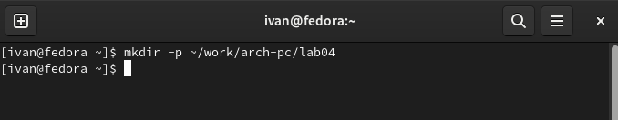{#fig:001 width=70%}

### 2
Перехожу в созданный каталог.

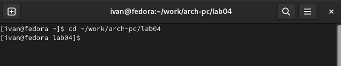{#fig:001 width=70%}

### 3
Создаю текстовый файл с именем hello.asm

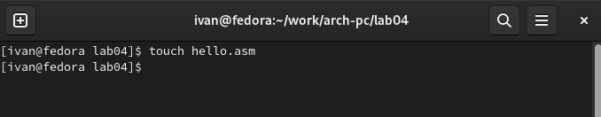{#fig:001 width=70%}

### 4
Открываю этот файл с помощью текстового редактора gedit.

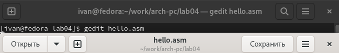{#fig:001 width=70%}

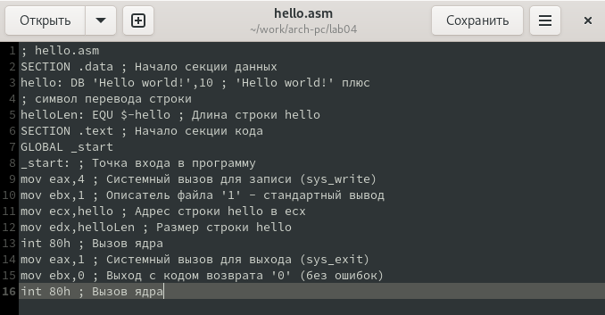{#fig:001 width=70%}

### 5
NASM превращает текст программы в объектный код.

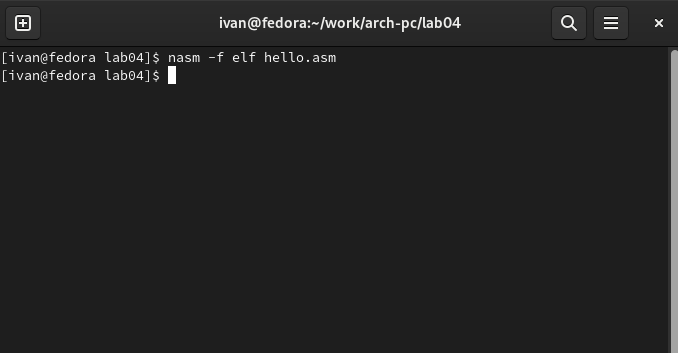{#fig:001 width=70%}

### 6
Полный вариант командной строки nasm выглядит следующим образом:

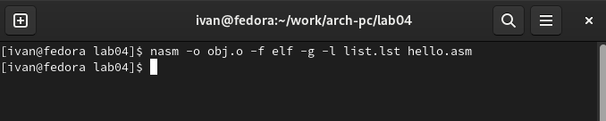{#fig:001 width=70%}

### 7
Чтобы получить исполняемую программу, объектный файл необходимо передать на обработку компоновщику:

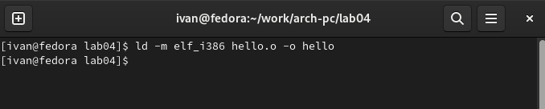{#fig:001 width=70%}

### 8
Ключ -o с последующим значением задаёт в данном случае имя создаваемого исполняемого файла.

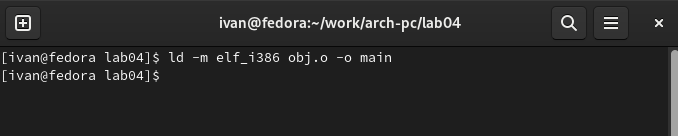{#fig:001 width=70%}

### 9
Запуск исполняемого файла.

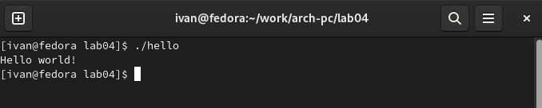{#fig:001 width=70%}

# Самостоятельная работа
### 1
В каталоге ~/work/arch-pc/lab04 с помощью команды cp

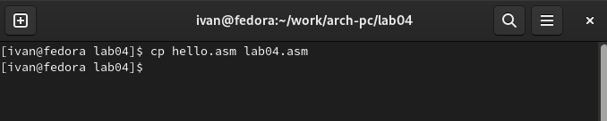{#fig:001 width=70%}

### 2
С помощью текстового редактора gedit ввожу изменения в тексте программы в файле lab04.asm вместо Hello world! ввожу Иван Салиндер.

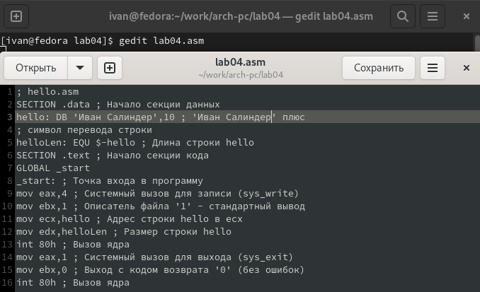{#fig:001 width=70%}

### 3
Оттранслирую полученный текст программы lab04.asm в объектный файл. Выполняю
компоновку объектного файла.

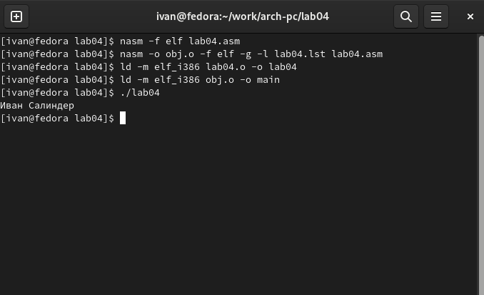{#fig:001 width=70%}

### 4
Копирую файлы hello.asm и lab04.asm в локальный репозиторий в каталог ~/work/study/2023-2024/"Архитектура компьютера"/arch-pc/labs/lab04/.

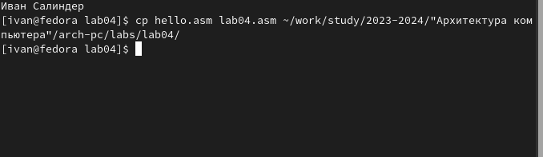{#fig:001 width=70%}

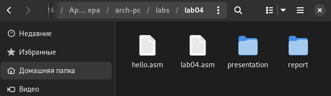{#fig:001 width=70%}

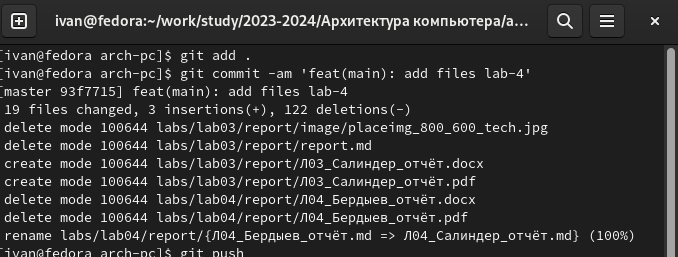{#fig:001 width=70%}

# Ответы на вопросы
1. Основное отличие ассемблера от языков высокого уровня — Байт-код или байтко́д (англ. byte-code), иногда также используется термин псевдоко́д — машинно-независимый код низкого уровня, генерируемый транслятором и исполняемый интерпретатором. Большинство инструкций байт-кода эквивалентны одной или нескольким командам ассемблера. Трансляция в байт-код занимает промежуточное положение между компиляцией в машинный код и интерпретацией.

2. Инструкция ассемблера генерирует машинный код, таким образом, способствует размеру программы. Директива ассемблера не создает какого -либо машинного кода, таким образом, не способствует размеру программы. IT приказывает ассемблеру выполнять определенные действия на этапе сборки.

3. Правила написания программ на языке assembler
Исходный текст программы на языке ассемблера имеет определенный формат. Каждая команда и директива представляет собой строку: Метка, операция,операнд(ы), комментарии.

4. Создание исполняемого файла издавна производилось в три этапа: (1) обработка исходного кода препроцессором, (2) компиляция в объектный код и (3) компоновка объектных модулей, включая модули из объектных библиотек, в исполняемый файл. Это классическая схема для компилируемых языков.

5. На этапе трансляции осуществляется перевод команд ассемблера в соответствующие машинные команды. В результате трансляции формируются файл объектного модуля и файл листинга.

6. Если в процессе ассемблирования не было выявлено ошибок в ассемблерном листинге, то программа-ассемблер создаcт объектный файл (с расширением OBJ).

Затем необходимо воспользоваться компоновщиком (линковщиком), который входит в комплект программы-ассемблера. Данная процедура выполняется гораздо быстрее ассемблирования.

Именно компоновщик создает готовый к запуску файл (программу) с расширением COM или EXE из объектного файла (OBJ). Оба типа имеют отличия в структуре ассемблерной программы. Первый тип (COM) не может превышать 64 Кбайт и используется только в MS-DOS (и для совместимости поддерживается в Windows), однако он очень компактный и удобный для написания небольших программ и резидентов. В большинстве случаев, если программа написана на чистом ассемблере под MS-DOS, нет необходимости создавать EXE-файлы. В этой книге в части I рассматриваются именно программы типа COM.

В отличие от создания программ типа COM, при создании стандартных EXEпрограмм под MS-DOS нет необходимости указывать какие-либо параметры линковщику при компоновке. Дело в том, что компоновщик не может автоматически определить, какой тип подвергается компоновке.

Линковщик также проверяет, нет ли каких-либо ошибок в объектном файле, но не грамматических, а логических. Например, отсутствие необходимой объектной библиотеки, указанной в самом файле либо в командной строке (программаассемблер этого не делает).

Если ошибки не были обнаружены, компоновщик создает машинный код (программу типа COM или EXE), которую можно запускать на выполнение.

7. Для того чтобы выполнить пробный прогон ассемблерной программы, ее необходимо сначала оттранслировать и скомпоновать. Пусть текст исходной программы хранится в файле с именем SIMPLE.ASM. Трансляцию можно осуществить вызовом турбо ассемблера TASM.EXE с помощью, например, следующей команды DOS:

tasm /l/z/zi/n simple.asm

8. NASM поддерживает множество форматов выходных файлов, среди них:

bin — файл произвольного формата, определяемого только исходным кодом. Пригоден как для файлов данных, так и для модулей с исполняемыми кодами — например, системных загрузчиков, образов ПЗУ, модулей операционных систем, драйверов .SYS в MS-DOS или исполняемых файлов .COM.
obj — объектный модуль в формате OMF, совместимый с MASM и TASM.
win32 и win64 — объектный модуль для 32- и 64-битного кода, совместимый с Win32- и Win64-компиляторами Microsoft.
aout — объектный модуль в варианте формата a.out, использовавшегося в ранних Linux-системах.
aoutb — версия формата a.out для BSD-совместимых операционных систем.
coff — объектный модуль в формате COFF, совместимом с компоновщиком из DJGPP.
elf32 и elf64 — объектный модуль в форматах ELF32 и ELF64, используемых в Linux и Unix System V, включая Solaris x86, UnixWare и SCO Unix.
Формат выходного файла можно задать с помощью ключа командной строки -f. Форматы могут расширять синтаксис некоторых инструкций и добавлять собственные инструкции.

# Выводы

В ходе выполнения этой лабораторной работы я освоил процедуру  компиляции и сборки программ, написанных на ассемблере NASM.

::: {#refs}
:::
