---
## Front matter
title: "Отчёт по лабораторной работе №5"
subtitle: "Дисциплина: архитектура компьютера"
author: "Иван Салиндер"

## Generic otions
lang: ru-RU
toc-title: "Содержание"

## Bibliography
bibliography: bib/cite.bib
csl: pandoc/csl/gost-r-7-0-5-2008-numeric.csl

## Pdf output format
toc: true # Table of contents
toc-depth: 2
lof: true # List of figures
lot: true # List of tables
fontsize: 12pt
linestretch: 1.5
papersize: a4
documentclass: scrreprt
## I18n polyglossia
polyglossia-lang:
  name: russian
  options:
	- spelling=modern
	- babelshorthands=true
polyglossia-otherlangs:
  name: english
## I18n babel
babel-lang: russian
babel-otherlangs: english
## Fonts
mainfont: PT Serif
romanfont: PT Serif
sansfont: PT Sans
monofont: PT Mono
mainfontoptions: Ligatures=TeX
romanfontoptions: Ligatures=TeX
sansfontoptions: Ligatures=TeX,Scale=MatchLowercase
monofontoptions: Scale=MatchLowercase,Scale=0.9
## Biblatex
biblatex: true
biblio-style: "gost-numeric"
biblatexoptions:
  - parentracker=true
  - backend=biber
  - hyperref=auto
  - language=auto
  - autolang=other*
  - citestyle=gost-numeric
## Pandoc-crossref LaTeX customization
figureTitle: "Рис."
tableTitle: "Таблица"
listingTitle: "Листинг"
lofTitle: "Список иллюстраций"
lotTitle: "Список таблиц"
lolTitle: "Листинги"
## Misc options
indent: true
header-includes:
  - \usepackage{indentfirst}
  - \usepackage{float} # keep figures where there are in the text
  - \floatplacement{figure}{H} # keep figures where there are in the text
---

# Цель работы

Целью данной лабораторной работы является приобретение практических навыков работы в Midnight Commander, освоение инструкций языка ассемблера mov и int.

# Задание

1. Открыть Midnight Commander.
2. Создать папку lab05, где будут храниться файлы лабортаорной работы №5.
3. Создать файл «lab5-1.asm», ввести текст программы. Оттранслировать текст
программы, выполнить компоновку объектного файла и запустить получившийся исполняемый файл.
4. Скачать с ТУИС файл «in_out.asm» и переместить его в каталог lab05.
5. Скопировать файл «lab5-1.asm» с именем «lab5-2.asm» и исправить текст
программы так чтобы использовались программы из внешнего файла
«in_out.asm».
6. Создать исполняемый файл и проверить его работу.
7. Создать копию файла «lab5-1.asm». Внести измененя в программу (без использования внешнего файла «in_out.asm»), так чтобы она работа по определённому алгоритму.
8. Создать копию файла «lab5-2.asm». Также исправить текст программы, но уже с использованием подпрограмм из внешнего файла «in_out.asm», так чтобы
она работала по определённуму алгоритму.
9. Создать исполняемые файлы и проверить их работу.

# Выполнение лабораторной работы

### Изучение Midnight Commander

Открываем Midnight Commander с помощью команды ‘mc’

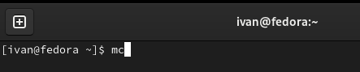{#fig:001 width=80%}

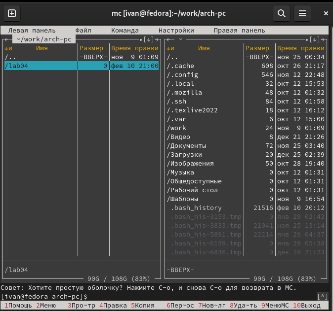{#fig:001 width=80%}

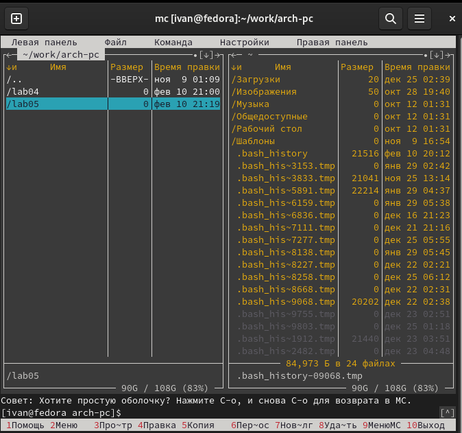{#fig:001 width=80%}

Перехожу в созданный каталог 

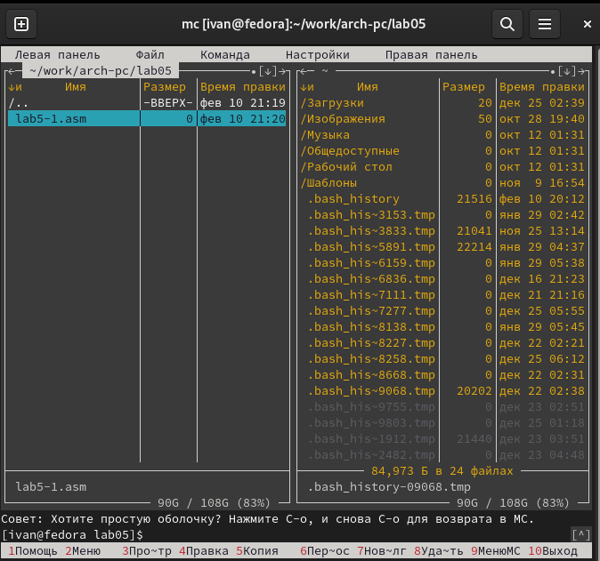{#fig:001 width=80%}

### Структура программы на языке ассемблера NASM

С помощью функциональной клавиши F4 открываю созданный файл для редактирования в редакторе nano.
Ввожу в файл код программы для запроса строки у пользователя. Далее выхожу из файла (Ctrl+X), сохраняя изменения (Y, Enter).

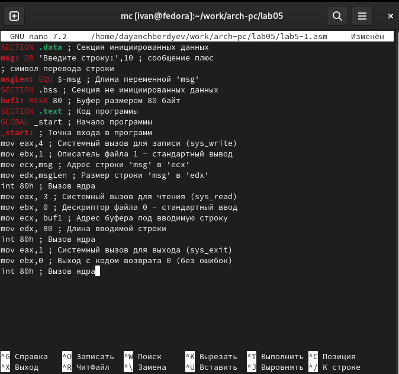{#fig:001 width=80%}

Транслирую текст программы файла в объектный файл командой nasm -f elf lab5-1.asm. Создался объектный файл lab5-1.o. Выполняю компоновку объектного файла с помощью команды ld -m elf_i386 -o lab5-1 lab5-1.o. Создался исполняемый файл lab5-1.

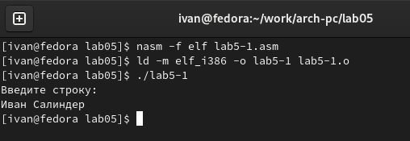{#fig:001 width=80%}

### Подключение внешнего файла

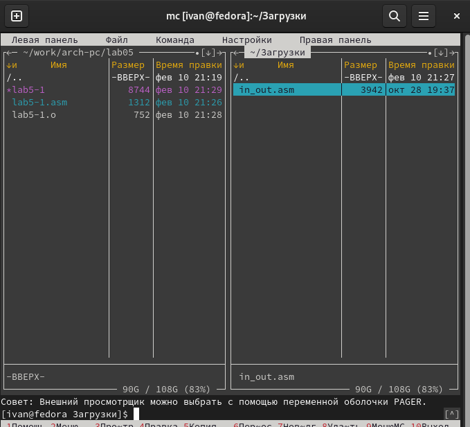{#fig:001 width=80%}

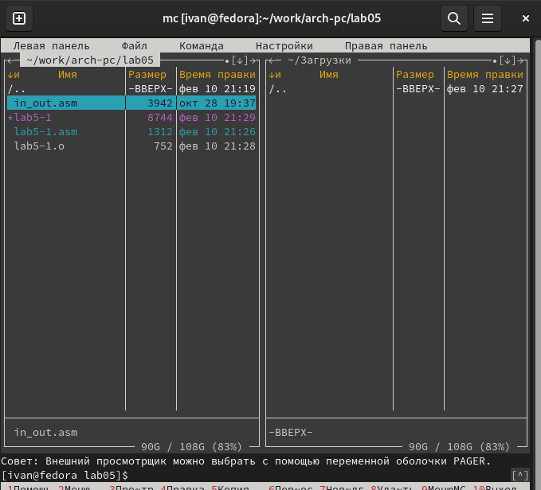{#fig:001 width=80%}

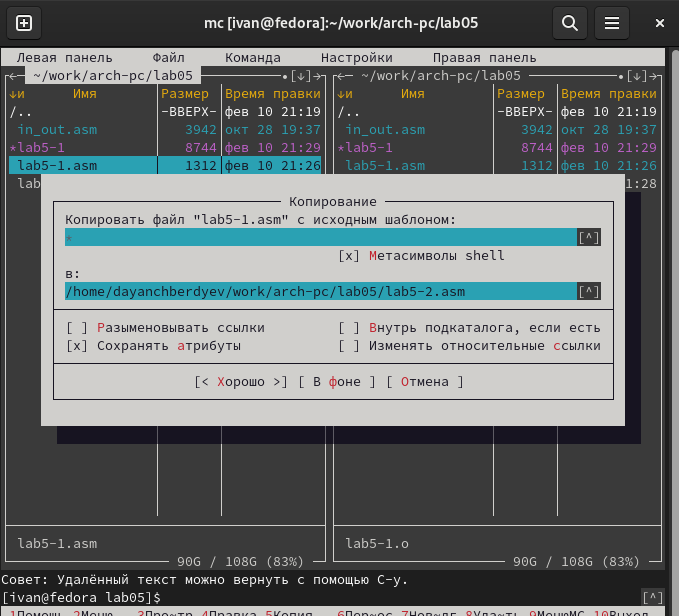{#fig:001 width=80%}

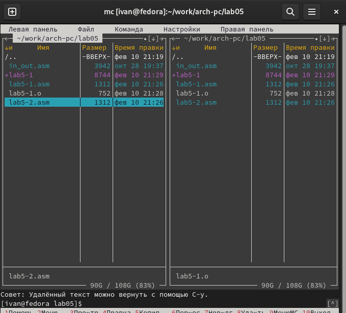{#fig:001 width=80%}

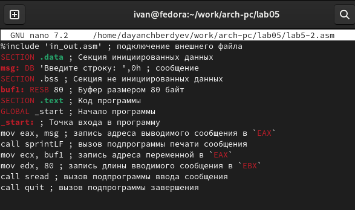{#fig:001 width=80%}

{#fig:001 width=80%}

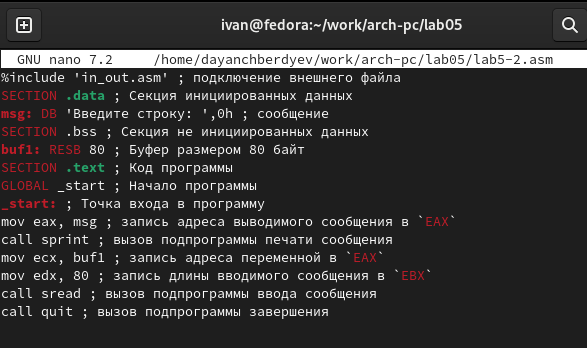{#fig:001 width=80%}

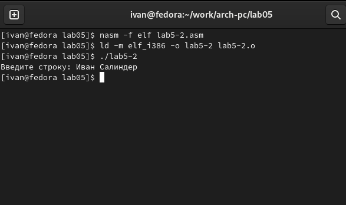{#fig:001 width=80%}

Разница между первым исполняемым файлом lab5-2 и вторым lab5-2 в том, что запуск первого запрашивает ввод с новой строки, а программа, которая исполняется при запуске второго, запрашивает ввод без переноса на новую строку, потому что в этом заключается различие между подпрограммами sprintLF и sprint.

# Выполнение заданий для самостоятельной работы

### 1
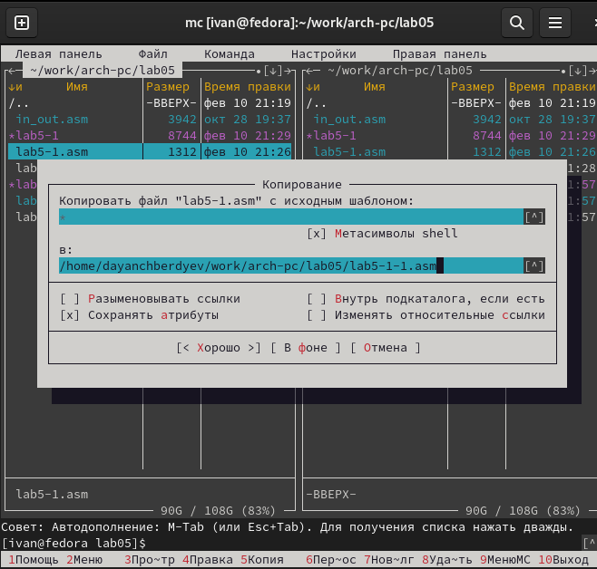{#fig:001 width=80%}

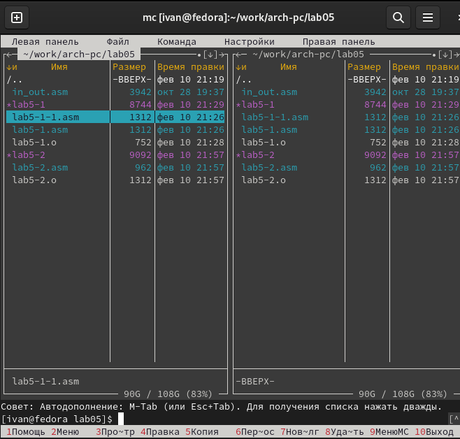{#fig:001 width=80%}

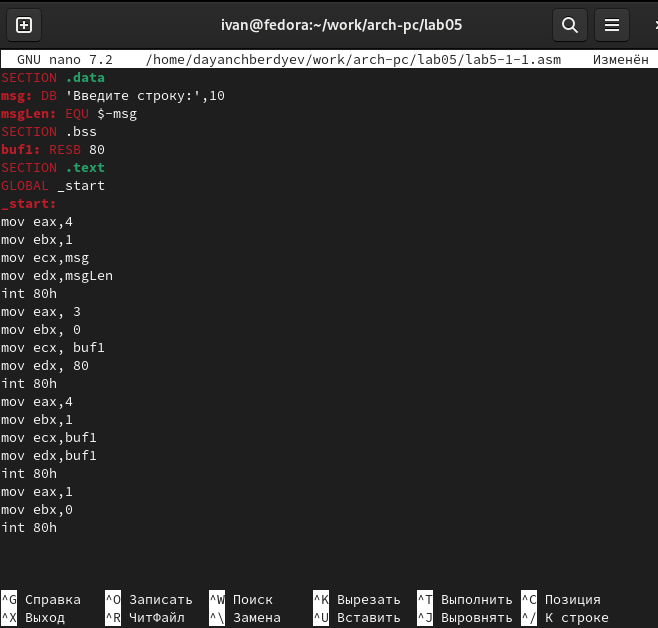{#fig:001 width=80%}

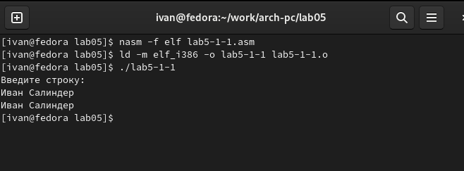{#fig:001 width=80%}

### 2

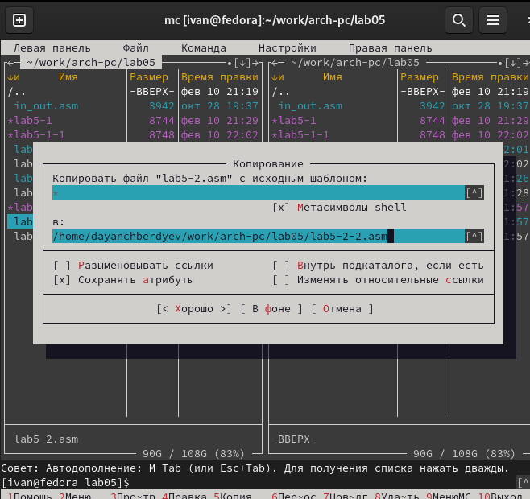{#fig:001 width=80%}

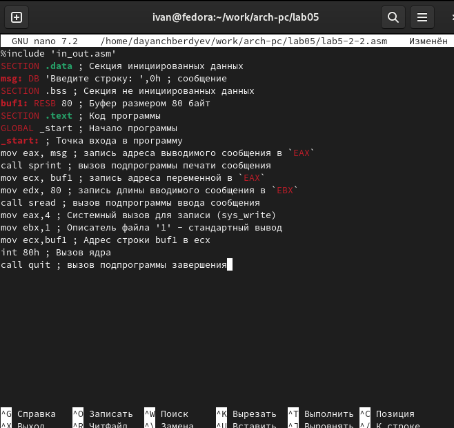{#fig:001 width=80%}

{#fig:001 width=80%}

# Выводы

При выполнении данной лабораторной работы я приобрел практические навыки работы в Midnight Commander, а также освоил инструкции языка ассемблера mov и int.

# Список литературы

1. GDB: The GNU Project Debugger. — URL: https://www.gnu.org/software/gdb/.
2. GNU Bash Manual. — 2016. — URL: https://www.gnu.org/software/bash/manual/.
3. Midnight Commander Development Center. — 2021. — URL: https://midnight-commander.
org/.
4. NASM Assembly Language Tutorials. — 2021. — URL: https://asmtutor.com/.
5. Newham C. Learning the bash Shell: Unix Shell Programming. — O’Reilly Media, 2005. —
354 с. — (In a Nutshell). — ISBN 0596009658. — URL: http://www.amazon.com/Learningbash-Shell-Programming-Nutshell/dp/0596009658.
6. Robbins A. Bash Pocket Reference. — O’Reilly Media, 2016. — 156 с. — ISBN 978-1491941591.
7. The NASM documentation. — 2021. — URL: https://www.nasm.us/docs.php.
8. Zarrelli G. Mastering Bash. — Packt Publishing, 2017. — 502 с. — ISBN 9781784396879.
9. Колдаев В. Д., Лупин С. А. Архитектура ЭВМ. — М. : Форум, 2018.
10. Куляс О. Л., Никитин К. А. Курс программирования на ASSEMBLER. — М. : Солон-Пресс,
2017.
11. Новожилов О. П. Архитектура ЭВМ и систем. — М. : Юрайт, 2016.
12. Расширенный ассемблер: NASM. — 2021. — URL: https://www.opennet.ru/docs/RUS/nasm/.
13. Робачевский А., Немнюгин С., Стесик О. Операционная система UNIX. — 2-е изд. — БХВПетербург, 2010. — 656 с. — ISBN 978-5-94157-538-1.
14. Столяров А. Программирование на языке ассемблера NASM для ОС Unix. — 2-е изд. —
М. : МАКС Пресс, 2011. — URL: http://www.stolyarov.info/books/asm_unix.
15. Таненбаум Э. Архитектура компьютера. — 6-е изд. — СПб. : Питер, 2013. — 874 с. —
(Классика Computer Science).
16. Таненбаум Э., Бос Х. Современные операционные системы. — 4-е изд. — СПб. : Питер, 2015. — 1120 с. — (Классика Computer Science).

::: {#refs}
:::
