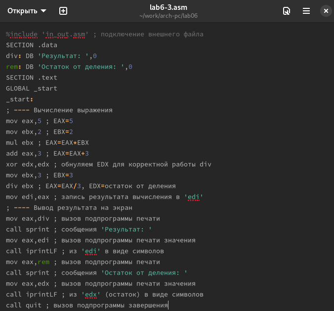

---
## Front matter
title: "Отчёт по лабораторной работе №6"
subtitle: "Дисциплина: архитектура компьютера"
author: "Иван Салиндер"

## Generic otions
lang: ru-RU
toc-title: "Содержание"

## Bibliography
bibliography: bib/cite.bib
csl: pandoc/csl/gost-r-7-0-5-2008-numeric.csl

## Pdf output format
toc: true # Table of contents
toc-depth: 2
lof: true # List of figures
lot: true # List of tables
fontsize: 12pt
linestretch: 1.5
papersize: a4
documentclass: scrreprt
## I18n polyglossia
polyglossia-lang:
  name: russian
  options:
	- spelling=modern
	- babelshorthands=true
polyglossia-otherlangs:
  name: english
## I18n babel
babel-lang: russian
babel-otherlangs: english
## Fonts
mainfont: PT Serif
romanfont: PT Serif
sansfont: PT Sans
monofont: PT Mono
mainfontoptions: Ligatures=TeX
romanfontoptions: Ligatures=TeX
sansfontoptions: Ligatures=TeX,Scale=MatchLowercase
monofontoptions: Scale=MatchLowercase,Scale=0.9
## Biblatex
biblatex: true
biblio-style: "gost-numeric"
biblatexoptions:
  - parentracker=true
  - backend=biber
  - hyperref=auto
  - language=auto
  - autolang=other*
  - citestyle=gost-numeric
## Pandoc-crossref LaTeX customization
figureTitle: "Рис."
tableTitle: "Таблица"
listingTitle: "Листинг"
lofTitle: "Список иллюстраций"
lotTitle: "Список таблиц"
lolTitle: "Листинги"
## Misc options
indent: true
header-includes:
  - \usepackage{indentfirst}
  - \usepackage{float} # keep figures where there are in the text
  - \floatplacement{figure}{H} # keep figures where there are in the text
---

# Цель работы

Цель данной лабораторной работы - освоение арифметческих инструкций языка ассемблера NASM.

# Задание

1. Символьные и численные данные в NASM
2. Выполнение арифметических операций в NASM
3. Выполнение заданий для самостоятельной работы

# Теоретическое введение

Большинство инструкций на языке ассемблера требуют обработки операндов. Адрес операнда предоставляет место, где хранятся данные, подлежащие обработке. Это могут быть данные хранящиеся в регистре или в ячейке памяти. 

Регистровая адресация – операнды хранятся в регистрах и в команде используются имена этих регистров, например: mov ax,bx.
Непосредственная адресация – значение операнда задается непосредственно в команде, Например: mov ax,2.
Адресация памяти – операнд задает адрес в памяти. В команде указывается символическое обозначение ячейки памяти, над содержимым которой требуется выполнить операцию.
Ввод информации с клавиатуры и вывод её на экран осуществляется в символьном виде. Кодирование этой информации производится согласно кодовой таблице символов ASCII. ASCII – сокращение от American Standard Code for Information Interchange (Американский стандартный код для обмена информацией). Согласно стандарту ASCII каждый символ кодируется одним байтом. Среди инструкций NASM нет такой, которая выводит числа (не в символьном виде). Поэтому, например, чтобы вывести число, надо предварительно преобразовать его цифры в ASCII-коды этих цифр и выводить на экран эти коды, а не само число. Если же выводить число на экран непосредственно, то экран воспримет его не как число, а как последовательность ASCII-символов – каждый байт числа будет воспринят как один ASCII-символ – и выведет на экран эти символы. Аналогичная ситуация происходит и при вводе данных с клавиатуры. Введенные данные будут представлять собой символы, что сделает невозможным получение корректного результата при выполнении над ними арифметических операций. Для решения этой проблемы необходимо проводить преобразование ASCII символов в числа и обратно

# Выполнение лабораторной работы

### Символьные и численные данные в NASM

С помощью утилиты mkdir создаю директорию, в которой буду создавать файлы с программами для лабораторной работы №6

{#fig:001 width=70%}

Копирую в текущий каталог файл in_out.asm с помощью утилиты cp, т.к. он будет использоваться в других программах

{#fig:001 width=70%}

Открываю созданный файл lab6-1.asm, вставляю в него программу вывода значения регистра eax 

{#fig:001 width=70%}

Создаю исполняемый файл программы и запускаю его. Вывод программы: символ j, потому что программа вывела символ, соответствующий по системе ASCII сумме двоичных кодов символов 4 и 6.

{#fig:001 width=70%}

Изменяю в тексте программы символы “6” и “4” на цифры 6 и 4.

{#fig:001 width=70%}

Создаю новый исполняемый файл программы и запускаю его. Теперь вывелся символ с кодом 10, это символ перевода строки, этот символ не отображается при выводе на экран.

{#fig:001 width=70%}

Создаю новый файл lab6-2.asm с помощью утилиты touch.

{#fig:001 width=70%}

Ввожу в файл текст другойпрограммы для вывода значения регистра eax.

{#fig:001 width=70%}

Создаю и запускаю исполняемый файл lab6-2. Теперь вывод число 106, потому что программа позволяет вывести именно число, а не символ, хотя все еще происходит именно сложение кодов символов “6” и “4”.

{#fig:001 width=70%}

Заменяю в тексте программы в файле lab6-2.asm символы “6” и “4” на числа 6 и 4.

{#fig:001 width=70%}

Создаю и запускаю новый исполняемый файл. Теперь программа складывает не соответствующие символам коды в системе ASCII, а сами числа, поэтому вывод 10.

{#fig:001 width=70%}

Заменяю в тексте программы функцию iprintLF на iprint.

{#fig:001 width=70%}

Создаю и запускаю новый исполняемый файл. Вывод не изменился, потому что символ переноса строки не отображался, когда программа исполнялась с функцией iprintLF, а iprint не добавляет к выводу символ переноса строки, в отличие от iprintLF.

{#fig:001 width=70%}

### Выполнение арифметических операций в NASM

Создаю файл lab6-3.asm с помощью утилиты touch. И проверяю с помощью ls.

{#fig:001 width=70%}

Ввожу в созданный файл текст программы для вычисления значения выражения f(x) = (5 * 2 + 3)/3

{#fig:001 width=70%}

Создаю исполняемый файл и запускаю его.

{#fig:001 width=70%}

Изменяю программу так, чтобы она вычисляла значение выражения f(x) = (4 * 6 + 2)/5

{#fig:001 width=70%}

Создаю и запускаю новый исполняемый файл.

{#fig:001 width=70%}

Создаю файл variant.asm с помощью утилиты touch.

{#fig:001 width=70%}

Ввожу в файл текст программы для вычисления варианта задания по номеру студенческого билета.

{#fig:001 width=70%}

Создаю и запускаю исполняемый файл. Ввожу номер своего студенческого билета с клавиатуры, программа вывела, что мой вариант 4.

{#fig:001 width=70%}

# Выполнение заданий для самостоятельной работы

Создаю файл lab6-4.asm с помощью утилиты touch.

{#fig:001 width=70%}

Открываю созданный файл для редактирования, ввожу в него текст программы для вычисления значения выражения X в степени 4/3*(x - 1) + 5. Это выражение было под вариантом 4.

{#fig:001 width=70%}

Создаю и запускаю исполняемый файл. При вводе значения 4, вывод 9.

{#fig:001 width=70%}

Провожу еще один запуск исполняемого файла для проверки работы программы с другим значением на входе. Программа отработала верно.

{#fig:001 width=70%}

# Выводы

При выполнении данной лабораторной работы я освоил арифметические инструкции языка ассемблера NASM.

# Список литературы{.unnumbered}

1. GDB: The GNU Project Debugger. — URL: https://www.gnu.org/software/gdb/.
2. GNU Bash Manual. — 2016. — URL: https://www.gnu.org/software/bash/manual/.
3. Midnight Commander Development Center. — 2021. — URL: https://midnight-commander.org/.
4. NASM Assembly Language Tutorials. — 2021. — URL: https://asmtutor.com/.
5. Newham C. Learning the bash Shell: Unix Shell Programming. — O’Reilly Media, 2005. — 354 с. — (In a Nutshell). — ISBN 0596009658. — URL: http://www.amazon.com/Learning bash-Shell-Programming-Nutshell/dp/0596009658.
6. Robbins A. Bash Pocket Reference. — O’Reilly Media, 2016. — 156 с. — ISBN 978-1491941591.
7. The NASM documentation. — 2021. — URL: https://www.nasm.us/docs.php.
8. Zarrelli G. Mastering Bash. — Packt Publishing, 2017. — 502 с. — ISBN 9781784396879.
9. Колдаев В. Д., Лупин С. А. Архитектура ЭВМ. — М. : Форум, 2018.
10. Куляс О. Л., Никитин К. А. Курс программирования на ASSEMBLER. — М. : Солон-Пресс, 2017.
11. Новожилов О. П. Архитектура ЭВМ и систем. — М. : Юрайт, 2016.
12. Расширенный ассемблер: NASM. — 2021. — URL: https://www.opennet.ru/docs/RUS/nasm/.
13. Робачевский А., Немнюгин С., Стесик О. Операционная система UNIX. — 2-е изд. — БХВ-Петербург, 2010. — 656 с. — ISBN 978-5-94157-538-1.
14. Столяров А. Программирование на языке ассемблера NASM для ОС Unix. — 2-е изд. — М. : МАКС Пресс, 2011. — URL: http://www.stolyarov.info/books/asm_unix.
15. Таненбаум Э. Архитектура компьютера. — 6-е изд. — СПб. : Питер, 2013. — 874 с. — (Классика Computer Science).
16. Таненбаум Э., Бос Х. Современные операционные системы. — 4-е изд. — СПб. : Питер, 2015. — 1120 с. — (Классика Computer Science).

::: {#refs}
:::
